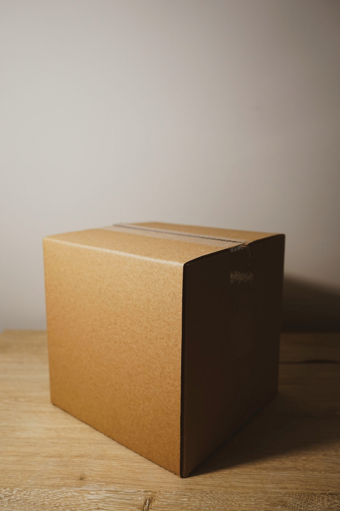
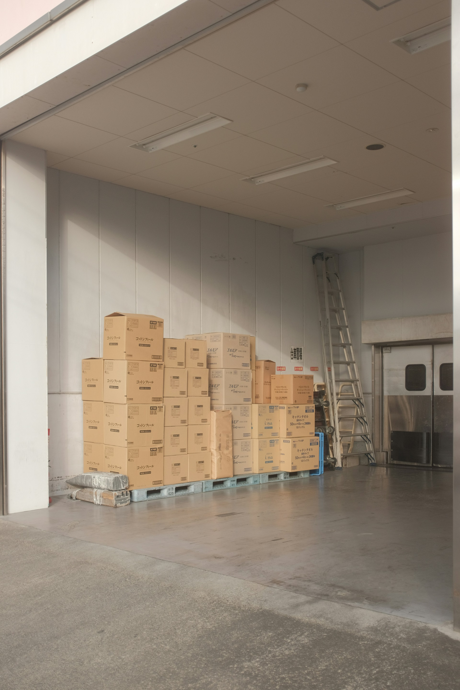
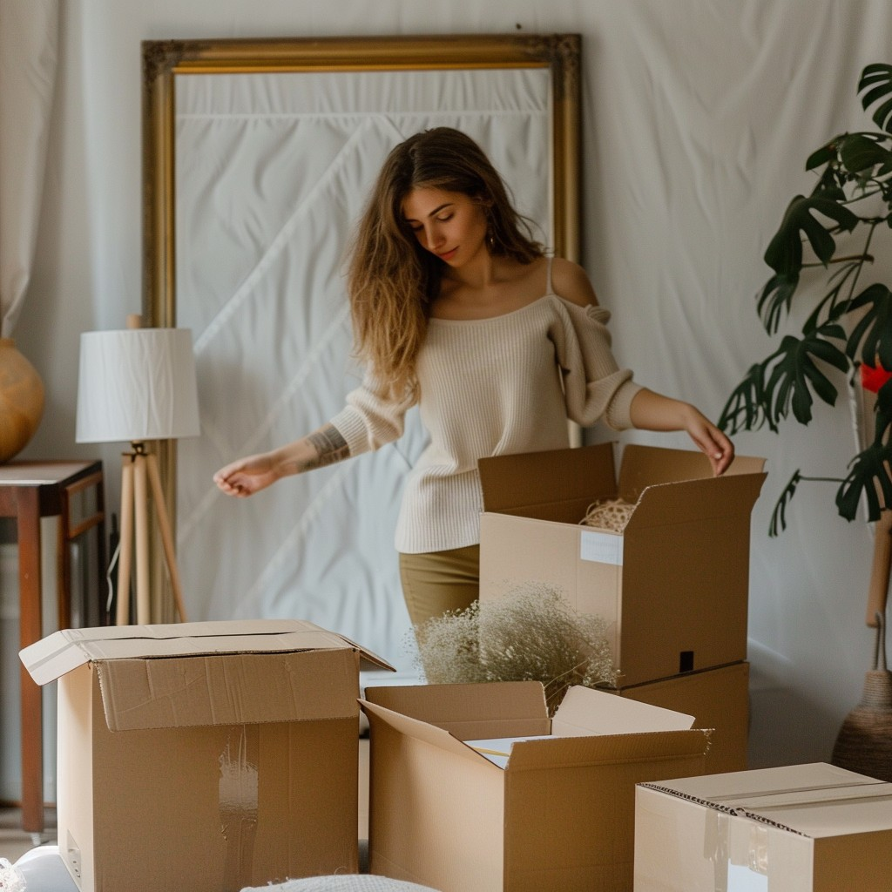

## CARTONES - CASI


"empesar de los contornos e ir hacia adentro primero html y despues css y depues JS"
 
"y empesar por la verción _mobile_, SIEMPRE"

nos vamos a guiar de la **arquitectura  CSS Minimalista(StyleGuides)**

* `CUSTOM PROPERTIES`
* `RESET`
* `COMPONENTS`
* `UTILITIES`
* `SITE STYLES`


### CUSTOM PROPERTIES


### RESET

cuando vamos de seccion en seccion usamos en el css:

```css
    scroll-behavior: smooth;
```

> `https://developer.mozilla.org/en-US/docs/Web/CSS/scroll-behavior`

TEXTO FLUIDO O RESPONSIVO (fragmento de código copiado de Bootstrap)

```css
h1 {
    font-size: calc(1.375rem + 1.5vw);
  }
```

Este fragmento de código CSS está aplicando un estilo a los elementos `<h1>` y a cualquier elemento con la clase `.h1`. La propiedad `font-size` está utilizando la función `calc()` para calcular el tamaño de la fuente de manera dinámica.

La expresión `calc(1.375rem + 1.5vw)` combina dos unidades de medida:
- `rem`: Unidad relativa al tamaño de la fuente raíz (generalmente el tamaño de la fuente del `<html>`).
- `vw`: Unidad relativa al ancho de la ventana gráfica (viewport width), donde 1vw es igual al 1% del ancho de la ventana.

Esto significa que el tamaño de la fuente será una combinación fija de `1.375rem` más un valor que depende del ancho de la ventana (`1.5vw`). Este enfoque permite que el tamaño de la fuente sea **responsivo**, ajustándose automáticamente según el tamaño de la ventana del navegador¹.


```css
    img{
    max-width: 100%;
    height: auto;
    border: none; /*Mudford*/
    display: block;/*mudford -  elimina esapcios*/
}
```

¡Claro! Este código es una regla CSS que se aplica a los elementos `` en una página web. Aquí te explico cada propiedad:

1. **`max-width: 100%;`**: Esta propiedad asegura que la imagen no exceda el ancho del contenedor en el que se encuentra. Si el contenedor es más pequeño que la imagen, la imagen se reducirá para ajustarse al contenedor.

2. **`display: block;`**: Esto hace que la imagen se comporte como un elemento de bloque, lo que significa que ocupará todo el ancho disponible y se alineará con otros elementos de bloque. Esto también elimina cualquier espacio en blanco que podría aparecer debajo de la imagen si se comportara como un elemento en línea.

3. **`height: auto;`**: Mantiene la proporción original de la imagen al ajustar su altura automáticamente en función de su ancho.

4. **`border: none;`**: Elimina cualquier borde que pueda tener la imagen por defecto.

Este conjunto de reglas es útil para hacer que las imágenes sean responsivas y se ajusten adecuadamente a diferentes tamaños de pantalla y contenedores.

```css
    /* *********************** Custom Properties ************************** */

:root{
    --first-color: #6A280F;
    --first-alpha-color: rgba(106, 40, 15, 0.75);
    --second-color: #EDD9C4;
    --second-alpha-color: rgb(237, 217, 196,0.75);
    --third-color: #576751;
    --third-alpha-color: rgba(87, 103, 81, 0.75);
    --white-color: #fff;
    --gray-light-color: #f3f3f3;
    --gray-color:#ccc;
    --gray-dark-color: #666;
    --black-color: #000;
    --link-color: #6EA8FE;
    --title-color: #333;
    --text-color: #222;
    --white-alpha-color: rgba(255, 255, 255, 0.5);
    --black-alpha-color: rgba(0, 0, 0, 0.5);

    /*tipografia -> importar de google Fonts*/
    --font: "Raleway", sans-serif;
    --header-height: 4rem;
    --max-width: 1200px;
}
/* *********************** Reset ************************** */
html{
    /*modelo de caja: vamos hacer que el tamaño de la caja empieze desde el borde
     y no desde el contenido como es por default por que si lo dejamos desde
     el contenido corremos el riesgo de que cuando asignamos paddings o borders
     pues los tamaños no correspondan*/
    box-sizing: border-box;
    font-family: var(--font); /*definimos la familia de fuente*/
    font-size: 16px; /*tamaño de letra del html explicitamente, ¿Por que?  
    por que como voy a estar utilizando la unidad de medida REM (rem es basado
    en el tamaño de la tipografia de la etiqueta html*/

    /*para la transicion*/
    scroll-behavior: smooth;
}


/*con el selector universal todo los elementos su contenido generado dinamicamente
    con after y before que hereden el tamaño de caja y ¿de quien van a heredar
    el tamaño de caja? del nodo principal que es la etiqueta html
*/
*,
*::after,
*::before{
    box-sizing: inherit; /*hereda*/
}
/*por defecto trae 8 pixeles de margin*/
body{
    margin: 0;
    overflow-x: hidden; /*oculta todo lo que desborda en el eje x (horizontal) oculta la barra de desplazamiento*/
    color: var(--text-color);
}

/*Estilo a los links*/
a{
    color: var(--link-color);
    transition: all 0.5s ease-out;
}
/*para quitar cuadro azul al hacer clic en icono o imagen tipo boton*/
/* (*) atributo css que aplica a todo*/
* {
  -webkit-tap-highlight-color: rgba(0, 0, 0, 0);
}

a:hover{
    opacity: 0.75;
}

/*todo los encabezados tienen un poco de margen ariba y abajo dependiendo
    del nivel de encabezado van variando los márgenes, lo que me gusta es
    resetar el margen de los encabezados a 0 y ya yo darle la distancia
    adecuada
*/

h6, h5, h4, h3, h2, h1{
    margin: 0;
}

/*la función calc() para calcular el tamaño de la fuente de manera dinámica.*/

/*De bootstrap */
h1 {
    font-size: calc(1.375rem + 1.5vw);
  }
  @media (min-width: 1200px) {
    h1 {
      font-size: 2.5rem;
    }
  }
  
  h2 {
    font-size: calc(1.325rem + 0.9vw);
  }
  @media (min-width: 1200px) {
    h2 {
      font-size: 2rem;
    }
  }
  
  h3 {
    font-size: calc(1.3rem + 0.6vw);
  }
  @media (min-width: 1200px) {
    h3 {
      font-size: 1.75rem;
    }
  }
  
  h4 {
    font-size: calc(1.275rem + 0.3vw);
  }
  @media (min-width: 1200px) {
    h4 {
      font-size: 1.5rem;
    }
  }
  
  h5 {
    font-size: 1.25rem;
  }
  
  h6 {
    font-size: 1rem;
  }
  

/*Imagenes Responsivas HACK*/
img{
    max-width: 100%;
    height: auto;
    border: none; /*Mudford*/
    display: block;/*mudford -  elimina esapcios*/
}
/*Estilo a los párrafos*/
p{
    line-height: 1.6rem;
}


/* ************************ -Componentes- *************************** */


/* ************************ -Utilities- *************************** */


/*Sombra para cajas*/
.box-shadow-1{
    /* box-shadow: 4px 4px 16px rgba(0, 0, 0, 0.25); */
    box-shadow: .25rem .25rem 1rem rgba(0, 0, 0, 0.25);
}

/*contenedor*/

.container{
  margin-left: auto;
  margin-right: auto;
  max-width: var(--max-width);
}


/* ************************ -Site Styles- *************************** */

```

---

**APARTIR DE AQUI COMENZAMOS A DESARROLLAR LA PÁGINA WEB**


para el boton hamburguesa usamos la libreria: `https://jonsuh.com/hamburgers/`

* mandamos a llamar la libreria de 'hamburguer css'

para eso utilizamos un _cdnjs.com_ y buscamos `hamburgers`

* copiamos el link y lo pegamos al head de nuestro index.

tenemos un problema con el header, esque está descentrado


```css
.hamburger {
    font: inherit;
    display: inline-block;
    overflow: visible;
    margin: 0;
    padding: 15px;
    cursor: pointer;
    transition-timing-function: linear;
    transition-duration: .15s;
    transition-property: opacity, filter;
    text-transform: none;
    color: inherit;
    border: 0;
    background-color: transparent;
}
```

indagando en el inspector de navegador me encontre este fragmento de código css que tiene la hamburguesa.

EL ICONO CON ANIMACIÓN YA PASO DE MODA CREO Y SERIA MÁS PESADO PARA EL NAVEGADOR INTERPRETARLO ADEMAS QUE ES MUY DIFICIL CENTRARLO (referente seria steam)

BOX ICONS ME DA ERROR EN EL HTML. 

este fragmento lo sacamos de studioManchas

```css
    .navbar-toggler-icon {
    display: inline-block;
    width: 1.5em;
    height: 1.5em;
    vertical-align: middle;
    background-image: var(--bs-navbar-toggler-icon-bg);
    background-repeat: no-repeat;
    background-position: center;
    background-size: 100%;
}
```

solucion: copiamos el CDN de link de bootstrap-icons y despues copiamos el SVG de el icono deseado.
lo copiamos sin modificar nada, todo lo vamos a modificar desde el CSS.


#### haciendo estilos del Header.


En la sección de **_site styles_**

```css
    .header{
  position: fixed;
  left: 0;
  bottom: 0;

  z-index: 999;
  padding: 1rem;
  width: 100%;
  height: var(--header-height); /*4rems*/
  background-color: var(--second-color);

}

.header> .container{
  height: 2rem; /*le puse altura fija*/
  display: flex;
  justify-content: space-between;
  align-items: center;
}
```

#### maquetando icono y Menú Mobile.

En la sección de **_Components_**

**estilos al boton menú (icono)**


```css

.menu-btn{
  outline: thin solid var(--first-color);
  border: 0;
  cursor: pointer;
  background-color: var(--second-color);
  display: flex;/*con esto centramos el icono*/
  align-items: center;

  width: 2rem;/*tamaño gemelo 1*/
  height: 2rem; /*tamaño gemelo 2*/
  /* vertical-align: middle; */
}

.menu-btn svg{
  fill: var(--first-color); /*aplicamos relleno a los svg's*/
  width: 2rem; /*tamaño gemelo 1*/
  height: 2rem; /*tamaño gemelo 2*/
}
```
**estilos al logo**


En la sección de **_site styles_**

```css
    .logo a{
    color: var(--first-color);
    font-weight: bold;
    font-size: 2rem;
    line-height: normal;
    text-decoration: none; /*quitamos la linea de enlace*/
}
```


**aplicando estilos al menú**


en la seccíon de **_Componentes_**

```css
    .menu {
  position: fixed;
  left: 0;
  bottom: var(--header-height);
  width: 100%;
  display: flex;
  flex-direction: column;
  background-color: var(--second-color);

  opacity: 0;
  pointer-events: none;
  transition: opacity 0.5s ease;
}

/*¿Cuando precionemos el menú, esta clase lo vamos a activar con JS?*/
.menu.is-active{ /*debe ir junto*/
  opacity: 1;
  pointer-events: auto;
}

.menu a{
  padding: 1rem; /*pading de 1 rem a los 4 lados*/
  font-size: 1.5rem;
  font-weight: bold;
  text-align: center;
  text-decoration: none;
  color: var(--first-color);
}

/*en el estado hover invertimos los colores*/
.menu a:hover{
  color: var(--white-color);
  background-color: var(--first-color);
}
```


añadimos la clase `none` al icono _close_ ❎

```html
    <svg class="none" xmlns="http://www.w3.org/2000/svg" width="16" height="16" fill="currentColor" class="bi bi-x" viewBox="0 0 16 16">
                    <path d="M4.646 4.646a.5.5 0 0 1 .708 0L8 7.293l2.646-2.647a.5.5 0 0 1 .708.708L8.707 8l2.647 2.646a.5.5 0 0 1-.708.708L8 8.707l-2.646 2.647a.5.5 0 0 1-.708-.708L7.293 8 4.646 5.354a.5.5 0 0 1 0-.708"/>
                </svg>
```

y en la seccion de **_utilities_** añadimos esta clase

```css
    .none{
  display: none;
}
```


#### Programación menú mobil

crea un archivo JS y vinculaló al index

```javascript
        ((d)=>{
    const $btnMenu = d.querySelector(".menu-btn"),
        $menu = d.querySelector(".menu");

    $btnMenu.addEventListener("click", (e)=>{
        //quiero que al primer elemento hijo en su lista de clases
        //le intercambie la clase "None"
        $btnMenu.firstElementChild.classList.toggle("none"); // primer click
        $btnMenu.lastElementChild.classList.toggle("none"); // segundo click
        $menu.classList.toggle("is-active");

    });

    d.addEventListener("click", (e)=>{
        //objeto= e.target
        //método = matches 
        if (!e.target.matches(".menu a")) return false
        // si el evento que origino el click es un enlace que está dentro del menú
        $btnMenu.firstElementChild.classList.remove("none"); 
        $btnMenu.lastElementChild.classList.add("none"); 
        $menu.classList.remove("is-active");

    })
})(document);
```

#### Maquetando HEADER Y MENÚ para escritorio.

usando la posicion fija en la cabecera para PC _FIXED_ 


usaremos el posicionamiento pegajoso(_Stiky_)

¿Cual es la ventaja? a diferencia del position fixed no tapa el contenido que está definido en el html.(guarda su espacio?)


> "PARA EVITAR PROBLEMAS DE MEDIA QUERIS TE RECOMIENDO QUE LOS PONGAS AL FINAL PARA QUE POR CASCADA HAGA LO QUE TIENE QUE HACER SIN PROBLEMAS" 💀💀 ( al final las media querys) 


el la seccion de **_site-Styles_**

añadimos las media querys (ero al final de esta sección.)

```css
  /* @media screen and (min-width:768px){ */
@media screen and (min-width:48em){

}

@media screen and (min-width:64em){
.header{
  position: sticky;
  top: 0;
  /*al Padding y el Height lo heredas de header mobile*/
}
}
```

añadimos media query al final de la sección de **_componenetes_** para el menú.

```css
@media screen and (min-width: 64rem){ /*respeta espacios entre el AND*/
  .menu-btn{
      display: none;
  }
  .menu{
      position: static;
      opacity: 1;
      width: auto;
      flex-direction: row;
      pointer-events: auto;
  }
  .menu a{
      padding: 0 1rem; /*solo costados*/
  }
  .menu a:last-child{
      padding-right: 0; /*por que el header ya tiene un pading*/
  }
  .menu a:hover{
      background-color: transparent; /*solo las letras cambian de color y no el fondo*/
  }
}
```


#### Maquetando sección Home y componenetes Hero Image.


"siempre vamos maquetando de el más grande a los más pequeño"

> ¡Recomendación! reduce el tamaño de la imgen a 1920px de ancho, el largo lo dejas como está. Esto para que tu página web sea más fluida, ya que al pesar casi 3Mb se veia tembloroso.

```html
  <!-- sección inicio -->
    <section id="inicio">
        <article class="hero-image" style="--hero-image: url(../assets/hero-image.jpg); --hero-attachment:fixed;">
            <aside class="hero-image-opacity" style="--hero-opacity-color: var(--black-alpha-color)">
                <!-- <div class="hero-image-content"> -->
                <div>
                    <h2 class="display-1 hero-image-title" style="--hero-text-color: var(--white-color)">
                        Venta al por mayor
                        <br>
                        Cajas de embalaje
                    </h2>
                    <br>
                    <a href="#contacto" class="btn">CONTÁCTAME</a>
                </div>
            </aside>
        </article>
    </section>
```

En la seccion de **_Components_**

```css
/* ***** HeroImage ***** */
.hero-image{
  background-image: var(--hero-image);
  background-repeat: no-repeat;
  background-size: cover;
  background-position: center;
  background-attachment: var(--hero-attachment);
}

.hero-image-opacity{
  width: 100%;
  min-height: 100vh;
  display: flex; /*es como si fuerra fiero aldente, puedes dar la forma que tu quieras*/
  justify-content: center;
  align-items: center;
  text-align: center;
  background-color: var(--hero-opacity-color);
}

.hero-image-title{
  color:var(--hero-text-color);
}
```


Cuando necesite que un encabezado se destaque, considere usar un encabezado de visualización , un estilo de encabezado más grande y ligeramente más formal. Es un tipo de Texto Fluido/responsivo

este fragmeto lo saque de Bootstrap.

pegamos en la seccion de: **_Utilities_**

```css
  .display-1 {
  font-size: calc(1.625rem + 4.5vw);
  font-weight: 300;
  line-height: 1.2;
}
@media (min-width: 1200px) {
  .display-1 {
    font-size: 5rem;
  }
}

.display-2 {
  font-size: calc(1.575rem + 3.9vw);
  font-weight: 300;
  line-height: 1.2;
}
@media (min-width: 1200px) {
  .display-2 {
    font-size: 4.5rem;
  }
}

.display-3 {
  font-size: calc(1.525rem + 3.3vw);
  font-weight: 300;
  line-height: 1.2;
}
@media (min-width: 1200px) {
  .display-3 {
    font-size: 4rem;
  }
}

.display-4 {
  font-size: calc(1.475rem + 2.7vw);
  font-weight: 300;
  line-height: 1.2;
}
@media (min-width: 1200px) {
  .display-4 {
    font-size: 3.5rem;
  }
}

.display-5 {
  font-size: calc(1.425rem + 2.1vw);
  font-weight: 300;
  line-height: 1.2;
}
@media (min-width: 1200px) {
  .display-5 {
    font-size: 3rem;
  }
}

.display-6 {
  font-size: calc(1.375rem + 1.5vw);
  font-weight: 300;
  line-height: 1.2;
}
@media (min-width: 1200px) {
  .display-6 {
    font-size: 2.5rem;
  }
}
```

resultado: 


**Dando estilos al boton (button)**

en la sección de **_Utilities_**

```css
.btn{
    border-radius: 0.5rem;
    padding: 1rem;
    /*los enlaces trabajan en linea pero quiero que tenga caracteristicas de linea y bloque*/
    display: inline-block;
    width: 200px;
    font-weight: bold;
    text-align: center;
    text-decoration: none;
    color: var(--white-color);
    background-color: var(--first-color);
}
```

#### Marcado HTML seccion Acerca.

Según la **Encuesta Nacional sobre Disponibilidad y Uso de las Tecnologías de la Información y Comunicación en los Hogares (ENDUTIH 2018, INEGI)**, aquí están los porcentajes de uso de dispositivos electrónicos en México:

- **Celular**: El **92.7%** de los usuarios de internet se conecta a través de un smartphone.
- **Computadora portátil**: El **32.6%** utiliza una laptop.
- **Computadora de escritorio**: El **32.0%** se conecta a través de una PC de escritorio.
- **Tablet**: El **17.8%** utiliza una tablet¹.

Es importante mencionar que estos porcentajes pueden variar según la edad y otros factores. Por ejemplo, los grupos más jóvenes tienden a usar más el celular, mientras que las computadoras de escritorio y portátiles son más comunes en adultos². Las laptops suelen ser ideales para trabajos más completos, mientras que las tablets ofrecen portabilidad y aplicaciones en un espacio más pequeño³⁴. ¡Espero que esta información te sea útil! 😊

por eso debemos dar más prioridad al diseño mobil y pc y por último a la tablet.


```html
  <!-- sección Acerca -->
     
    <section id="acerca" class=" section container ">
        <article class="text-center">
            <aside class="">
                <h1>Cartones Casi</h1>
                <h6>Venta de cartones para embalaje</h6>
            </aside>
            <p>Cartones CASI se ha convertido en un socio de confianza para las personas que buscan <b>soluciones</b> de embalaje y materia prima para diversos productos.</p>
            <p>Ofrecemos una amplia gama de cajas, láminas y cartones grandes de segunda mano para todo tipo de uso, también ofrecemos entregas a domicilio.</p>
            <p></p>
        </article>
        <article class="">
            
        </article>
        <article class="about-card">
            
            <h3>Entrega Oportuna</h3>
            <p>Entregamos a tiempo para garantizar que los planes de producción y comercialización del cliente no se vean afectados.</p>
            
            <!--FALTA: SVG -->
            <h3>Material 100% recilado</h3>
            <p>El material que ofrecemos es 100% reciclado y está en un estado muy bueno.</p>
        </article>
    </section>

    <!-- Sección de Fotos -->

    <section class="">
        <div class="container">
            <h3 class="section-title">Fotos de Exibición</h3>

            <article class="photos-card">
                
            </article>
            <article class="photos-card">
                
            </article>
            <article class="photos-card">
                
            </article>
        </div>
    </section>

    <!-- sección card Productos e ¿interesado? -->

    <section class="">
        <div class="container">
            <article class="">
                
                <div class="">
                    <h3>Productos 📦</h3>
                    <p>Proporcionamos una variedad de opciones de materiales para satisfacer las necesidades de embalaje de diferentes productos.</p>
                    <a href="productos.html">Más detalles >></a>
                </div>
            </article>
            <article class="">
                
                <div class="">
                    <h3>¿interesado? ☎</h3>
                    <p>Envíe su solicitud de cotización y generaremos una cotización completa para el material que usted necesita.</p>
                    <a href="productos.html">Más detalles >></a>
                </div>
            </article>
        </div>
    </section>
```
#### Maquetando la sección Acerca


le damos padding a las secciones, y tambien añadimos las distintas posiciones de texto (centro, izquierda, derecha) .

en la seccion de css llamada **_UTILITIES_** 

agregamos esta clase:

```css
  .section{
  padding: 2rem 1rem;
}

.text-center{
    text-align: center;
}

.text-left{
    text-align: left;
}

.text-right{
    text-align: right;
}

```

en la sección de **_Site Styles_**

```css
  .about-card{
  margin: 1rem auto; /*ariba y a los costado (para que se centre)*/
  padding: 1rem;
  text-align: center;
}

.about-card svg{
  margin-bottom: 1.25rem;
  fill: var(--first-color);
}
.bg-color-main{
  background-color: var(--gray-light-color);
}

```

para aplicar espaciados utilizamos estas clases, lo saqué de bootstrap.

en la sección de **_utilities_**

```css
  /*para aplicar espaciados como en bootstrap*/


/*margin Top*/
.mt-0 {
  margin-top: 0  ;
}

.mt-1 {
  margin-top: 0.25rem  ;
}

.mt-2 {
  margin-top: 0.5rem  ;
}

.mt-3 {
  margin-top: 1rem  ;
}

.mt-4 {
  margin-top: 1.5rem  ;
}

.mt-5 {
  margin-top: 3rem  ;
}

.mt-auto {
  margin-top: auto  ;
}

/*margin bottom*/
.mb-0 {
  margin-bottom: 0  ;
}

.mb-1 {
  margin-bottom: 0.25rem  ;
}

.mb-2 {
  margin-bottom: 0.5rem  ;
}

.mb-3 {
  margin-bottom: 1rem  ;
}

.mb-4 {
  margin-bottom: 1.5rem  ;
}

.mb-5 {
  margin-bottom: 3rem  ;
}

.mb-auto {
  margin-bottom: auto  ;
}

```

#### Maquetando la sección Fotos de exhibición

en la sección de **_utilities_**

```css
  .section-title{
  border-top: thin solid var(--first-color);
  border-bottom: thin solid var(--first-color);
  margin: 2rem auto; /*Con esto se centra y los margenes laterales se adaptan segun el espacio sobrante*/
  padding: 0.5rem 1rem; /*nos sirve para separar el texto de los bordes de la caja*/
  width: 280px;
  text-align: center;
  color: var(--title-color);
}
```

En la sección de **_site Styles_**

```css
  /* fotos de exhibición*/
  .photos-card > img{
    position: relative;
    width: 100%;
    margin: 0 auto;
    display: block; /*para que  estén uno debajo del otro*/
    border-radius: 25% 10%; /*lo saque de mozilla mdn*/
  }
```

#### Maquetando la sección empecemos


en la sección de **_Componentes_**

```css

  /* *card */

.card{
  width: 18rem;
  padding: 1rem;
  border-radius: 1rem 1rem 0 0;
  /* background-image: linear-gradient(to right, rgb(96, 56, 19), rgb(178, 159, 148)); */
}

.card-container{
  padding: 1rem;
}

.cards-container{
  display: flex;
  flex-direction: column;
  justify-content: center;
  align-items: center;
  gap: 2rem;
}
```


En la sección de **_Site Styles_**

```css
  /*card*/

.card h3{
  border-bottom: medium solid var(--first-color);
  margin: 1rem auto; /*ariba y bajo, Costados*/
  padding: 0.5rem 0;
  color: var(--title-color);
}

.footer{
  margin-bottom: var(--header-height);
  padding: 0.5rem;
  text-align: center;
  color: var(--white-color);
  background-color: var(--third-color);
}
```
#### Marcado html de la página Productos


```html
          <!-- sección products-cards -->
        <section class="section">
            <div class="container cards-container">
               
    
                <article class="card p-0">
                    
                    <div class="card-container">
                        <h3 class="text-center">Exportación 📦</h3>
                        <small class="color-list">
                            <ul>
                                <li>
                                    <b>Cantidad mínima de pedido:</b> xx
                                </li>
                                <li>
                                    <b>tiempo de entrega:</b> 1-5 días hábiles
                                </li>
                            </ul>
                            <br>    
                        </small>
                        <p class="text-center">
                            <a href="productos.html" class="btn-small"> <b>Contactar Ahora</b></a>
                        </p>
                    </div>
                </article>
```

la UL tiene por defecto 40px de padding inicial y nosotros lo vamos a reducir a 1rem


en la sección de **_site Stiles_**

```css
  .color-list b{
  color:var(--first-color);
}

.color-list ul{
  padding-inline-start: 1rem;
}
```
en la sección de **_utilities_** usamos estas utilidades de Bootstrap para quitar o agrear paddigs

```css
  /*aplica margen a los 4 lados*/

.m-0 {
  margin: 0  ;
}

.m-1 {
  margin: 0.25rem  ;
}

.m-2 {
  margin: 0.5rem  ;
}

.m-3 {
  margin: 1rem  ;
}

.m-4 {
  margin: 1.5rem  ;
}

.m-5 {
  margin: 3rem  ;
}

.m-auto {
  margin: auto  ;
}


/*aplica padding a los 4 lados*/

.p-0 {
  padding: 0  ;
}

.p-1 {
  padding: 0.25rem  ;
}

.p-2 {
  padding: 0.5rem  ;
}

.p-3 {
  padding: 1rem  ;
}

.p-4 {
  padding: 1.5rem  ;
}

.p-5 {
  padding: 3rem  ;
}
```


en la sección de componentes por que un boton es un componente **_components_**

```css
  .btn-small{
  border-radius: 0.5rem;
  padding: 0.5rem;
  /*los enlaces trabajan en linea pero quiero que tenga caracteristicas de linea y bloque*/
  display: inline-block;
  width: 10rem;
  font-weight: bold;
  text-align: center;
  text-decoration: none;
  color: var(--white-color);
  background-color: var(--first-color);
}
```

#### Maquetando especificaciónes de Cada Producto. (incluye fotos) las que faltan

Hacemos que las imagenes sean un enlace que nos lleve a otra página.

y le damos un efecto Zoom a las imágenes. todo esto en la sección: **_My Styles_**

```css
/*Efecto Zoom  las imágenes*/
.img-card-container{
width: 18rem;
height: 18rem;
display: block; /*la etiqueta es una A y se comporta en linea, yo quiero que se comporte en bloque.*/
overflow: hidden;/*esto para que cuando agrandemos la imagen no se vea sobresalido*/
}

.img-zoom{
  width: 100%;
  height: 100%;
  transition: 0.4s ease;
 /* object-fit: cover; */
  /* cursor: pointer; */
}

.img-zoom:hover{
  transform: scale(1.2);
}
```

> Para el carousel usé el componente carousel de Bootstrap.

Maquetando Uno de los productos

```html
   <section class="section container p-3">

            <article>
                <!-- añadimo para que comienze a corer automáticamente despues de la primera interracion -->
                <div id="carousel-img" class="carousel slide tamaño-800" data-bs-ride="true">
                    <div class="carousel-indicators">
                      <button type="button" data-bs-target="#carousel-img" data-bs-slide-to="0" class="active" aria-current="true" aria-label="Slide 1"></button>
                      <button type="button" data-bs-target="#carousel-img" data-bs-slide-to="1" aria-label="Slide 2"></button>
                      <button type="button" data-bs-target="#carousel-img" data-bs-slide-to="2" aria-label="Slide 3"></button>
                      <button type="button" data-bs-target="#carousel-img" data-bs-slide-to="3" aria-label="Slide 4"></button>
                    </div>
                    <div class="carousel-inner">
                      <div class="carousel-item active">
                        
                      </div>
                      <div class="carousel-item">
                        
                      </div>
                      <div class="carousel-item">
                        
                      </div>
                      <div class="carousel-item">
                        
                      </div>
                    </div>
                    <!-- control de izquierda y derecha -->
                    <button class="carousel-control-prev" type="button" data-bs-target="#carousel-img" data-bs-slide="prev">
                      <span class="carousel-control-prev-icon" aria-hidden="true"></span>
                      <span class="visually-hidden">Previous</span>
                    </button>
                    <button class="carousel-control-next" type="button" data-bs-target="#carousel-img" data-bs-slide="next">
                      <span class="carousel-control-next-icon" aria-hidden="true"></span>
                      <span class="visually-hidden">Next</span>
                    </button>
                  </div>
            </article>

            <article class="">
                <h3 class="text-center Subtitle">Cartón Exportación</h3>
                <p>
                    Las cajas de embalaje <b>Exportación</b> ofrecen una solución de embalaje para una variedad de productos.
                </p>
                <p>
                    Fabricadas con cartón resistente de doble hoja, estas cajas garantizan durabilidad y proteccion del contenido durante el almacenamiento y el transporte.
                </p>
            </article>

            <article class="">
                <h3 class="text-center Subtitle"><b>Especificaciones</b></h3>
                <!-- <span> se comporta en linea, P: se comporta en bloque -->
                <span class="color-list">
                    <ul >
                        <li class="mb-2"><b>Dimenciones: </b>L= , A= .</li>
                        <li class="mb-2"><b>Uso: </b>industrial, prendas de vestir, mudanzas, almacenamiento.</li>
                        <li class="mb-2"><b>Precio Final: </b> se adaptará a la cantidad que necesite.</li>
                    </ul>
                </span>
                <br>
                <!-- podemos colocar un pequeño formulario con el nombre preselecíonado más un correo o telefono -->
                <p class="text-center">
                    <a href="contacto.html" class="btn-small"> Contactar Ahora</a>
                </p>
            </article>
        </section>
```

en la sección de **_Components_** creamos el estilo para los subtitulos

```css
  .Subtitle{
    /* border-bottom: medium solid var(--first-color); */
    margin: 1rem auto;
    padding: 0.5rem 0;
    color: var(--first-color);
  }
```


#### maquetando para cada producto y maquetando la seccion de CONTACTENOS/CONTACTOS


